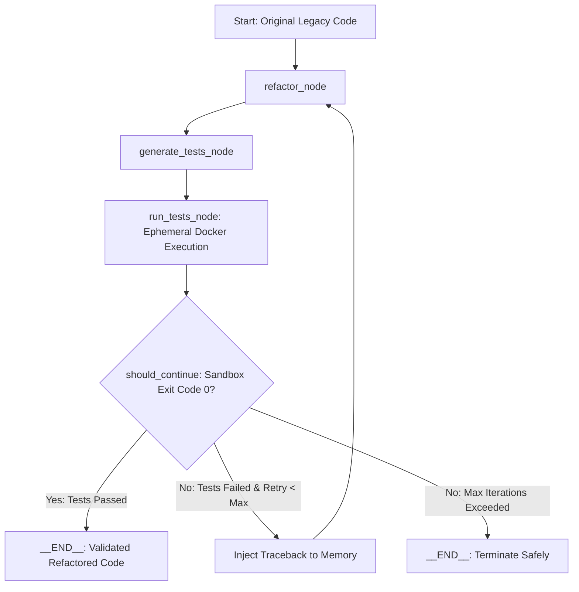
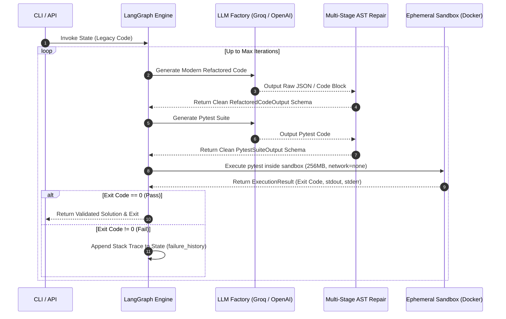

# Self-Healing Code Refactoring Agent

[](https://www.python.org/downloads/)
[](https://github.com/langchain-ai/langgraph)
[](https://www.docker.com/)
[](#-benchmark--evaluation-metrics)
[](https://github.com/psf/black)

An enterprise-grade autonomous agentic system built with **LangGraph**, **Pydantic v2**, and **Docker** that refactors legacy Python code into modern, typed Python 3.10+, automatically generates `pytest` test suites, and executes closed-loop self-healing inside an isolated execution container.

---

## 🎯 Architectural Overview

Unlike zero-shot LLM code generators that output unvalidated code, this system implements a **deterministic, closed-loop feedback control graph**:

### LangGraph State Topology



### Self-Healing Sequence Diagram



---

## 🔒 Security Architecture (Zero-Trust Sandbox)

Executing AI-generated code directly on host machines introduces severe Remote Code Execution (RCE) vulnerabilities. This project implements a hardened, non-root Docker sandbox execution engine using the Strategy Pattern (`AbstractSandbox`):

* **Zero Network Socket Exposure (`network_mode="none"`)**: Prevents socket creation or egress data exfiltration from generated code.
* **Strict Cgroup Resource Limits**: Constrains memory allocation to 256MB RAM to mitigate memory-exhaustion Denial-of-Service attacks.
* **Non-Root Execution**: Runs scripts under an unprivileged system user (`sandboxuser`).
* **Process Timeouts**: Hard termination timeouts prevent infinite loop locks inside containers.

---

## 📊 Benchmark & Evaluation Metrics

Evaluated across a 15-scenario technical debt benchmark suite (`data/benchmarks/test_cases.json`) covering untyped dictionary accesses, recursive bottlenecks, mutable default arguments, unclosed file handles, and bare exception handling:

### Empirical System Performance

| Metric | Empirical Measurement |
| :--- | :--- |
| **Pass@1 Rate (First Try Pass)** | 93.33% (14 / 15) |
| **Pass@N Rate (Self-Healed Resolution)** | 100.0% (15 / 15) |
| **Average Iterations to Convergence** | 1.07 iterations |
| **Total Benchmark Suite Execution Time** | 144.01 seconds |
| **Sandbox Container Spin-up Overhead** | ~0.51s per test pass |
| **AST Parse Recovery Reliability** | 100.0% via multi-stage fallback pipeline |

### Detailed Test Case Matrix

| Benchmark ID | Benchmark Name | Status | Iterations | Duration |
| :--- | :--- | :---: | :---: | :---: |
| `bench_01_dictionary_filtering` | Untyped Dictionary Filtering | ✅ PASSED | 1 | 47.32s |
| `bench_02_fibonacci_recursion` | Inefficient Recursive Fibonacci | ✅ PASSED | 1 | 9.31s |
| `bench_03_string_aggregation` | Inefficient String Concatenation | ✅ PASSED | 2 | 12.87s |
| `bench_04_mutable_default_args` | Mutable Default Parameter Bug | ✅ PASSED | 1 | 6.72s |
| `bench_05_unhandled_dict_get` | Unsafe Key Access & Fallbacks | ✅ PASSED | 1 | 6.71s |
| `bench_06_unclosed_file_handle` | Unclosed File IO Handle | ✅ PASSED | 1 | 6.14s |
| `bench_07_manual_sum_loop` | Imperative Accumulation Loop | ✅ PASSED | 1 | 5.15s |
| `bench_08_duplicate_dict_keys` | Redundant Dict Transformation | ✅ PASSED | 1 | 6.35s |
| `bench_09_manual_type_casting` | Unsafe String to Int Conversion | ✅ PASSED | 1 | 6.92s |
| `bench_10_imperative_filtering` | Manual Deduplication and Filter | ✅ PASSED | 1 | 7.14s |
| `bench_11_deprecated_has_key` | Legacy Dictionary Key Verification | ✅ PASSED | 1 | 5.79s |
| `bench_12_nested_indexing` | Unsafe Deep Nested Indexing | ✅ PASSED | 1 | 6.32s |
| `bench_13_global_state_mutation` | Global Counter Side Effect Pattern | ✅ PASSED | 1 | 5.36s |
| `bench_14_raw_exception_swallowing` | Bare Exception Catching | ✅ PASSED | 1 | 6.65s |
| `bench_15_legacy_formatting` | Legacy String Construction | ✅ PASSED | 1 | 5.23s |

---

## 🛠️ AST-Level Defensive Parsing Pipeline

Open-weights models frequently emit unescaped triple-quotes, raw markdown fences, or malformed JSON payloads when generating multi-line code.

To eliminate schema validation crashes, `src/agent/nodes.py` uses a 4-stage fallback pipeline:

1. **Explicit Regex Extraction**: Isolates JSON block boundaries (`{ ... }`).
2. **Native JSON Deserialization**: Validates payloads directly against Pydantic models.
3. **Pushdown Automata Repair (`json_repair`)**: Corrects missing brackets, raw unescaped quotes, and trailing commas.
4. **Structural Raw Code Fallback**: Extracts Python code blocks directly if the model bypasses JSON structure entirely.

---

## 🚀 Quickstart

### Prerequisites

* Python 3.10+
* Docker Desktop (running)
* Groq API Key (or OpenAI API Key)

### Installation & Setup

```bash
# 1. Clone repository
git clone https://github.com/your-username/self-healing-refactor-agent.git
cd self-healing-refactor-agent

# 2. Set up virtual environment
python -m venv .venv
source .venv/bin/activate  # On Windows: .venv\Scripts\activate

# 3. Install package in editable mode
pip install -e ".[dev]"
```

### Environment Setup

Create a `.env` file in the project root:

```env
GROQ_API_KEY=gsk_your_groq_api_key_here
LLM_PROVIDER=groq
GROQ_MODEL=llama-3.3-70b-versatile
LANGCHAIN_TRACING_V2=false
```

---

## 💻 Usage

### Command Line Interface (CLI)

Run the refactoring agent on any Python target:

```bash
refactor-agent --file sample_input.py --max-iterations 3
```

### Run Benchmark Suite

Run the quantitative evaluation harness locally:

```bash
python -m evals.eval_runner
```

### Integration Unit Tests

Run the full Pytest integration suite validating Docker isolation and state nodes:

```bash
python -m pytest tests/ -v -s
```

---

## 📁 Project Structure

```plaintext
self-healing-refactor-agent/
├── .github/workflows/
│   └── eval.yml              # Automated CI/CD Regression Evaluation Pipeline
├── data/
│   └── benchmarks/
│       └── test_cases.json   # 15 Technical Debt Benchmark Scenarios
├── evals/
│   ├── results/              # Output Metric Logs
│   └── eval_runner.py        # Quantitative Evaluation Engine
├── src/
│   ├── agent/
│   │   ├── factory.py        # LLM Engine Factory
│   │   ├── graph.py          # LangGraph Control Workflow
│   │   ├── nodes.py          # State Transformation & AST Parsers
│   │   ├── prompts.py        # Isolated System Prompt Registry
│   │   └── schemas.py        # Pydantic Memory Contracts
│   ├── sandbox/
│   │   ├── base.py           # Abstract Sandbox Strategy Interface
│   │   └── docker_sandbox.py # Docker Execution Sandbox Engine
│   └── cli.py                # Terminal UI Application
├── tests/                    # Integration Test Suite
├── pyproject.toml            # Package Specs & Dependencies
├── sample_input.py           # Sample Target Script
└── README.md                 # System Architecture & Documentation